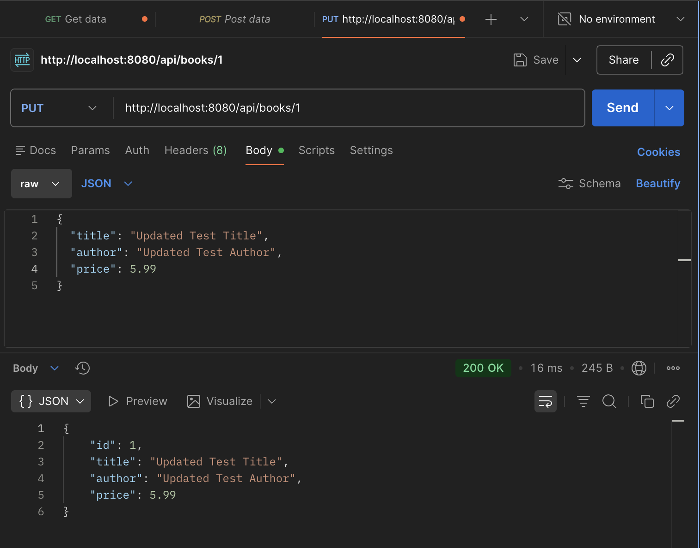
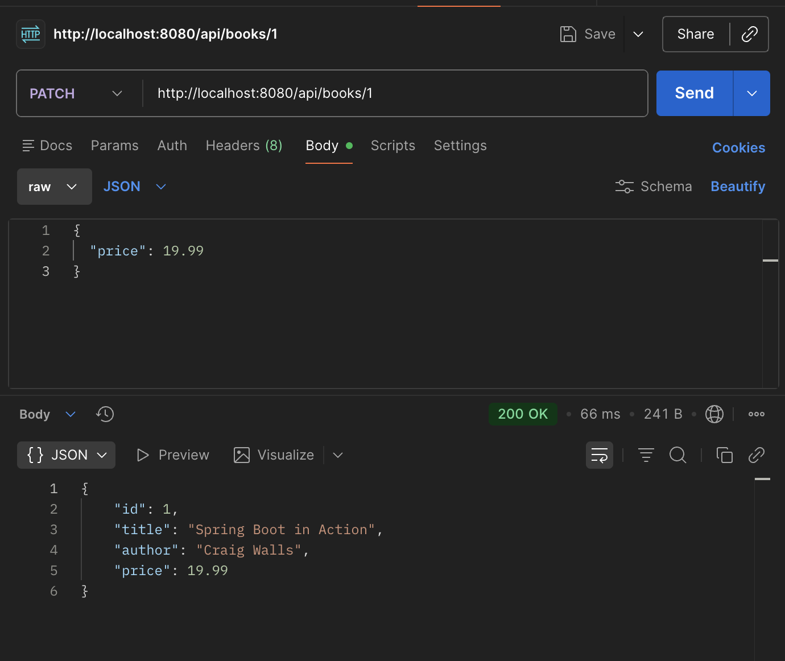
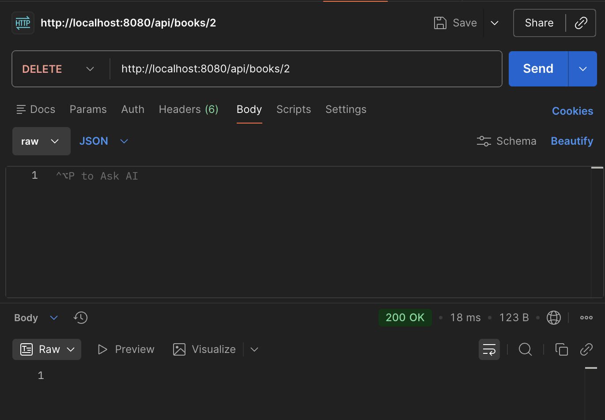
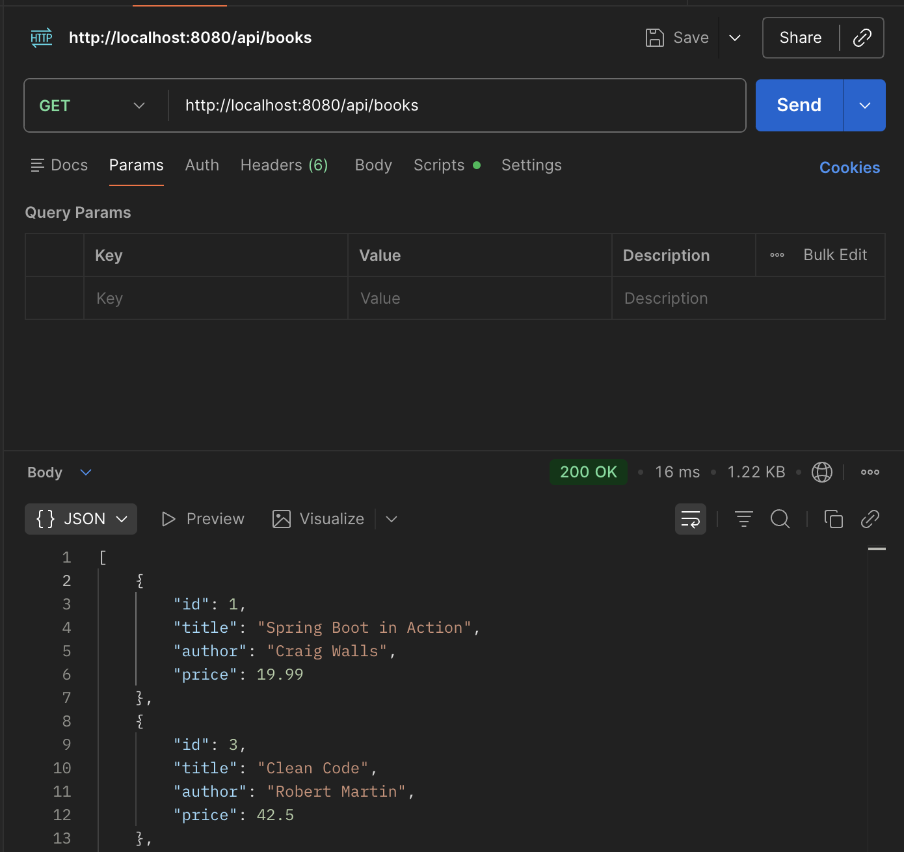
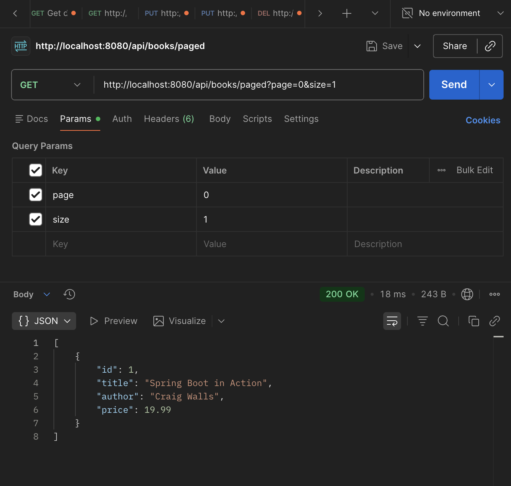
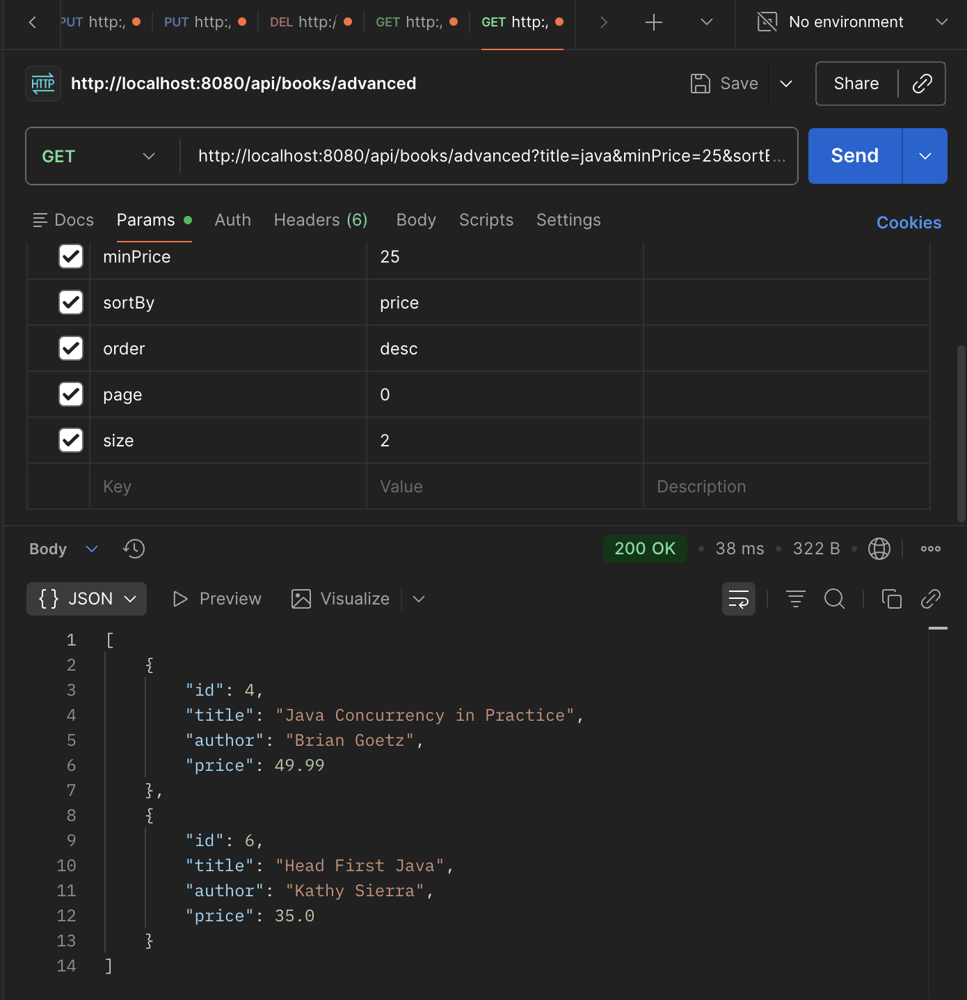

# Webbackend HW1 - Book API

## PUT - Update Book
Endpoint:
PUT /api/books/{id}

## PATCH - Partial Update
Endpoint:
PATCH /api/books/{id}

## DELETE - Remove Book
Endpoint:
DELETE /api/books/{id}

Using GET to show deleted book

## Pagination
Endpoint:
GET /api/books/paged?page=0&size=1

## Advanced Endpoint
Endpoint:
GET /api/books/advanced?title=java&minPrice=25&sortBy=price&order=desc&page=0&size=2

